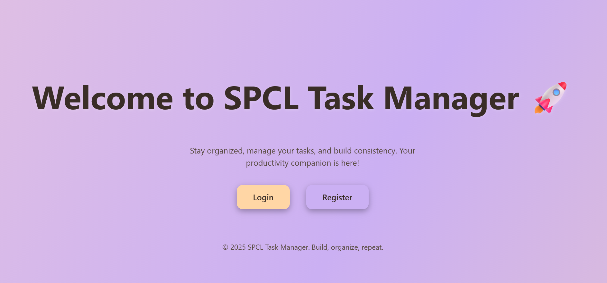
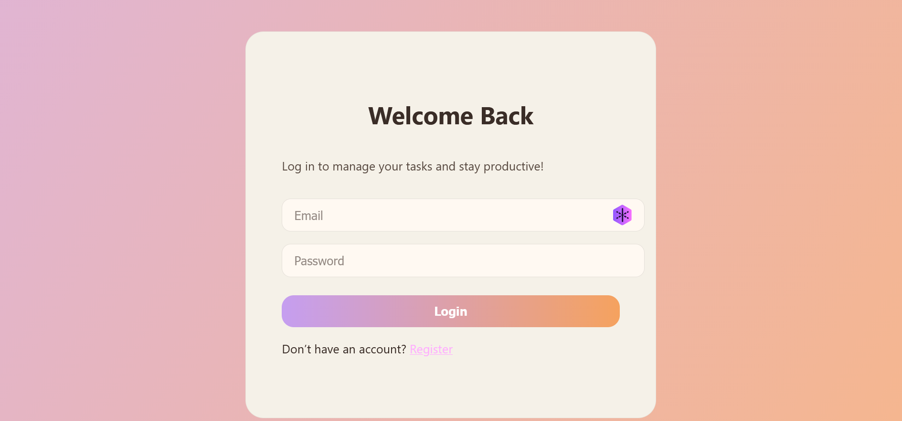
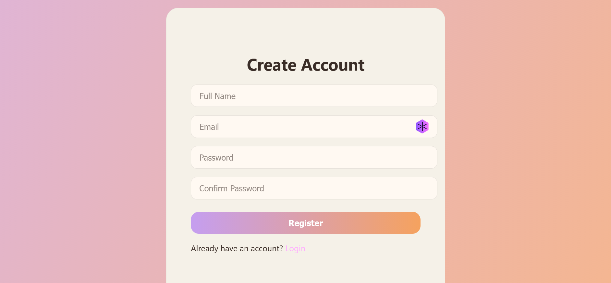
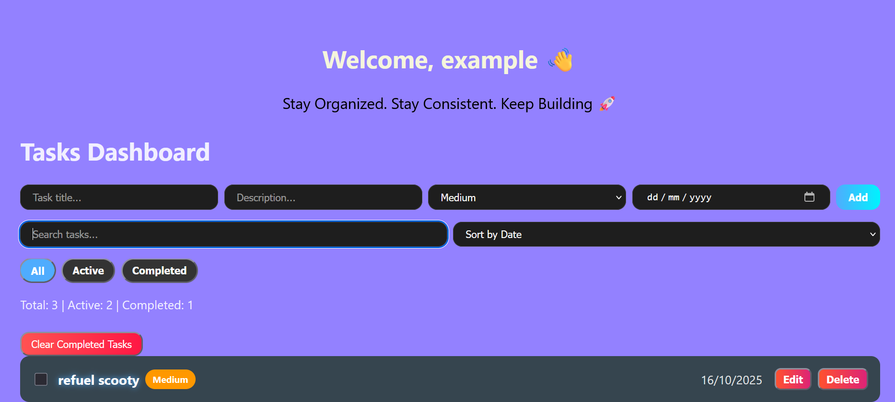

# SPCL Task Manager

SPCL Task Manager is a full-stack web application that allows users to efficiently manage their tasks with a modern, responsive, and user-friendly interface. Built with **React** for the frontend, **Node.js/Express** for the backend, and **PostgreSQL** as the database, it includes features like task creation, editing, priority management, due dates, filtering, sorting, and more.

---

## Features

* User authentication with JWT (register and login)
* Create, update, and delete tasks
* Mark tasks as completed
* Set task priority (High, Medium, Low) with color-coded badges
* Add due dates to tasks
* Filter tasks by All, Active, Completed
* Sort tasks by Date, Priority, or Alphabetically
* Search tasks by title
* Clear all completed tasks
* Responsive and modern UI with smooth animations and hover effects
* Welcome and motivational message on dashboard

---

## Tech Stack

* **Frontend:** React, CSS/Tailwind
* **Backend:** Node.js, Express
* **Database:** PostgreSQL
* **Authentication:** JWT

---

## Installation

### Backend

1. Clone the repository:

```bash
git clone <repository-url>
cd backend
```

2. Install dependencies:

```bash
npm install
```

3. Create a `.env` file with the following environment variables:

```env
PORT=5000
DATABASE_URL=<your_postgres_connection_string>
JWT_SECRET=<your_jwt_secret>
```

4. Start the backend server:

```bash
npm run dev
```

The backend server will run on `http://localhost:5000`.

### Frontend

1. Navigate to the frontend directory:

```bash
cd frontend
```

2. Install dependencies:

```bash
npm install
```

3. Update the API base URL in `src/api/axios.js` if needed:

```javascript
const API = axios.create({
  baseURL: "http://localhost:5000/api"
});
```

4. Start the frontend:

```bash
npm start
```

The app will run on `http://localhost:3000`.

---

## Usage

1. Open the app in your browser at `http://localhost:3000`.
2. Register a new account or log in with existing credentials.
3. Add new tasks using the input form with optional description, priority, and due date.
4. Use the search bar, filters, and sort options to organize your tasks.
5. Mark tasks as completed by checking the checkbox next to the task.
6. Edit or delete tasks using the corresponding buttons.
7. Clear all completed tasks with the "Clear Completed Tasks" button.
8. Logout when done.

---

## 🚀 Deployment

This project is fully deployed with the following stack:

* **Frontend**: Vercel
* **Backend**: Render
* **Database**: Railway (PostgreSQL)

---

### 1. Backend Deployment (Render)

1. Push your backend code to a public GitHub repository.
2. Go to [Render](https://render.com/) and create a new **Web Service**.
3. Connect your GitHub repository and select the backend folder.
4. Set the **Build Command** and **Start Command** as:

   ```bash
   Build Command: npm install
   Start Command: npm start
   ```
5. Add the following **Environment Variables** in Render:

   ```bash
   DATABASE_URL=<Your Railway PostgreSQL Connection URL>
   JWT_SECRET=<Your Secret Key>
   FRONTEND_URL=<Your Vercel Domain>
   PORT=10000
   ```
6. Deploy and note down your backend URL, for example:

   ```
   https://task-manager-application-w05c.onrender.com
   ```

---

### 2. Frontend Deployment (Vercel)

1. Push your frontend code to a GitHub repository.
2. Visit [Vercel](https://vercel.com/) and import the frontend repo.
3. Set up the following **Environment Variables** in Vercel (if required):

   ```bash
   REACT_APP_API_URL=https://task-manager-application-w05c.onrender.com/api
   ```
4. Deploy and verify your frontend URL, for example:

   ```
   https://full-stack-todo-list-application.vercel.app
   ```

---

### 3. Database Deployment (Railway)

1. Go to [Railway](https://railway.app/) and create a new **PostgreSQL** project.
2. Copy the **Connection URL** and paste it into your backend `.env` or Render environment variables.
3. Connect using `psql` or a GUI client (e.g., TablePlus, pgAdmin) to manage and inspect data.

---

### 4. Connecting Everything

* Ensure your backend `CORS` configuration includes:

  ```js
  const allowedOrigin = process.env.FRONTEND_URL || "*";
  app.use(cors({ origin: allowedOrigin, credentials: true }));
  ```
* Ensure the frontend `axios.js` base URL points to the deployed backend:

  ```js
  const API = axios.create({
    baseURL: "https://task-manager-application-w05c.onrender.com/api", //you backend url
  });
  ```

---

### 5. Verification Steps

After both deployments:

1. Open your frontend URL on Vercel.
2. Test user registration and login.
3. Verify tasks CRUD operations (add, update, delete, filter).
4. Confirm data persistence in the Railway database.

---

### Final Deployment URLs

* **Frontend**: [https://full-stack-todo-list-application.vercel.app](https://full-stack-todo-list-application.vercel.app)
* **Backend API**: [https://task-manager-application-w05c.onrender.com/api](https://task-manager-application-w05c.onrender.com/api)
* **Database**: PostgreSQL on Railway


---

## Screenshots

### Homepage



### Login Page



### Register Page



### Tasks Dashboard



